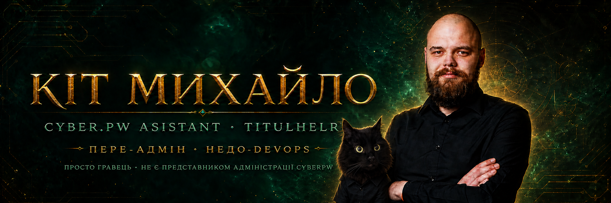

  

<h1 align="center">Кіт Михайло · CyberPW-Asistant</h1>

  <strong>Інструменти та помічники для Perfect World</strong> 
  CyberPW · DarkSide Clan · Windows 7/10/11

  
  

  
  
  

  
  
  
  

---

## 🚀 CyberPW Assistant · 0.90 Design Preview

Неофіційний portable-лаунчер та набір інструментів для гравців CyberPW:

- **TitulHelper** — 259 точок титулів, автоматичні координати, OCR і збереження прогресу;
- **MultiLauncher** — зашифровані профілі та запуск кількох персонажів;
- **Розморозка вікон** — окремий вибір клієнтів для фонового рендера;
- **Світові боси** — українська база координат, розклад і швидкі мітки;
- **Календар івентів** — компактний тижневий розклад;
- **Симулятор скрині** — перевірка шансів випадіння;
- **Macro Studio (клікер) — Beta**: графічні сценарії клавіатури, миші, циклів і кольору пікселя;
- **Карта територіальних війн (ГВГ) — Beta**: локальна інтерактивна карта без автоматичної серверної синхронізації;
- світла й темна теми, адаптивні вікна та підтримка Windows 7/10/11.

  <a href="https://github.com/vitalikjukivskiy/titul_helper/releases"><strong>⬇️ Відкрити актуальні релізи CyberPW Assistant</strong></a>
  ·
  <a href="https://github.com/vitalikjukivskiy/titul_helper"><strong>📖 Відкрити репозиторій</strong></a>

---

  Звичайний гравець, який створює корисні штуки для спільноти CyberPW. 
  <em>Не є представником адміністрації CyberPW.</em>

<strong>Пере-адмін · Недо-DevOps · Кіт Михайло 🐈‍⬛</strong>

